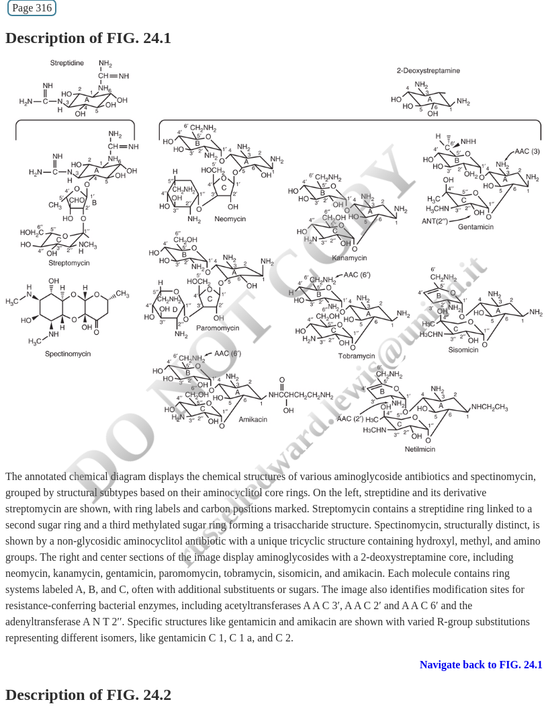
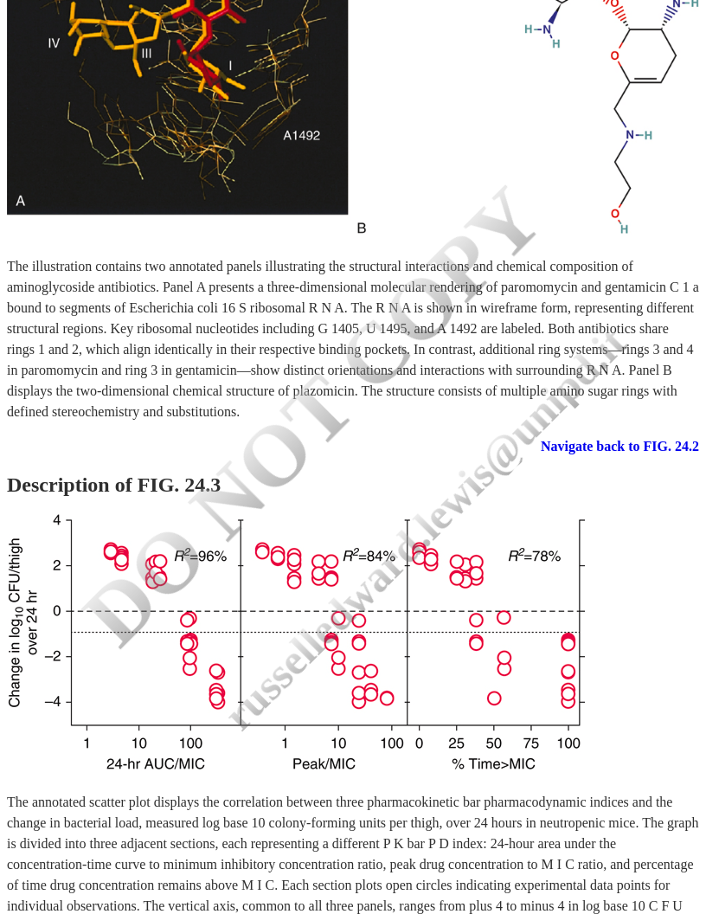
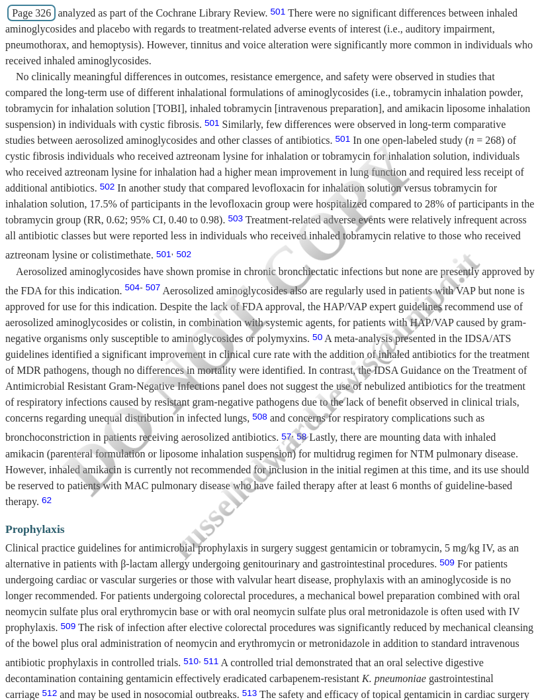

## Aminoglycosides {background-color="#b20e10"}

 

   

**Russell E. Lewis**   Associate Professor of Infectious Diseases  

{fig-align="center" width="250"}

   russelledward.lewis\@unipd.it    [https://github.com/Russlewisbo](https://github.com/Russlewisbo/ESCMID_2022_talk)   Slides and course materials: [www.idpadova.com](https://padovaid.com/)

## Learning Objectives

 

By the end of this lecture, you will be able to:

1.  Describe the mechanism of action and pharmacodynamic properties
2.  Compare the spectrum of activity among aminoglycoside agents
3.  Apply weight-based and renal-adjusted dosing strategies
4.  Identify patients at risk for nephrotoxicity and ototoxicity
5.  Design appropriate therapeutic drug monitoring plans
6.  Select appropriate aminoglycosides for specific clinical scenarios

::: notes
This is a comprehensive 1-hour lecture on aminoglycosides. We'll cover history, mechanism, PK/PD, clinical use, dosing, toxicity, and monitoring. Encourage questions throughout.
:::

------------------------------------------------------------------------

## Lecture Outline

 

::::: columns
::: {.column width="50%"}
**Part 1: Fundamentals**

- History & Discovery
- Chemical Structure
- Mechanism of Action
- PK/PD Principles
:::

::: {.column width="50%"}
**Part 2: Clinical Application**

- Spectrum & Resistance
- Dosing Strategies
- Adverse Effects
- Therapeutic Monitoring
- Clinical Scenarios
:::
:::::

------------------------------------------------------------------------

# PART 1: Fundamentals {background-color="#b20e10"}

------------------------------------------------------------------------

## Historical Timeline

 

| Year | Discovery                           |
|------|-------------------------------------|
| 1944 | Streptomycin (first aminoglycoside) |
| 1949 | Neomycin                            |
| 1957 | Kanamycin                           |
| 1963 | Gentamicin                          |
| 1967 | Tobramycin                          |
| 1972 | Amikacin                            |
| 2018 | Plazomicin                          |

::: notes
Streptomycin was discovered by Selman Waksman's group at Rutgers through systematic screening of soil actinomycetes. It was the first effective treatment for tuberculosis. The class has evolved over 75+ years.
:::

------------------------------------------------------------------------

## The Discovery of Streptomycin

 

- **1943-1944:** Selman Waksman's laboratory at Rutgers
- Systematic screening of soil actinomycetes
- Isolated from *Streptomyces griseus*
- First effective treatment for tuberculosis
- Waksman awarded Nobel Prize (1952)

> "The grueling search through 10,000 soil samples yielded streptomycin"

::: notes
The discovery process was methodical - testing thousands of soil samples for antimicrobial activity. This approach led to the "golden age" of antibiotic discovery.
:::

------------------------------------------------------------------------

## Nomenclature Convention

 

**"-mycin" suffix**

- Derived from *Streptomyces* species
- Examples: Streptomycin, Neomycin, Kanamycin, Tobramycin

**"-micin" suffix**

- Derived from *Micromonospora* species
- Examples: Gentamicin, Sisomicin, Plazomicin

::: notes
This naming convention is useful for remembering the source organism. Both genera are soil actinomycetes.
:::

------------------------------------------------------------------------

## Currently FDA-Approved Agents

 

| Agent          | Year | Primary Use                       |
|----------------|------|-----------------------------------|
| **Gentamicin** | 1963 | Gram-negative infections, synergy |
| **Tobramycin** | 1967 | *Pseudomonas*, CF                 |
| **Amikacin**   | 1972 | Resistant gram-negatives, TB      |
| **Plazomicin** | 2018 | CRE, MDR organisms                |

Streptomycin: Limited availability (TB, plague, tularemia)

::: notes
Gentamicin remains most commonly used for synergy. Tobramycin preferred for Pseudomonas. Amikacin reserved for resistant organisms. Plazomicin is newest, designed to evade resistance mechanisms.
:::

------------------------------------------------------------------------

## Chemical Structure Overview

 

{width="85%"}

::: notes
All aminoglycosides contain an aminocyclitol ring (streptidine or 2-deoxystreptamine) connected to amino sugars. The specific sugar attachments determine spectrum and susceptibility to modifying enzymes.
:::

------------------------------------------------------------------------

## Structural Classification

 

**Streptidine-containing:**

- Streptomycin (unique structure)

**2-Deoxystreptamine (4,5-disubstituted):**

- Neomycin, Paromomycin

**2-Deoxystreptamine (4,6-disubstituted):**

- Kanamycin, Amikacin, Tobramycin
- Gentamicin, Sisomicin, Plazomicin

::: notes
The 4,6-disubstituted compounds are most clinically relevant today. Understanding structure helps predict which resistance mechanisms will affect which drugs.
:::

------------------------------------------------------------------------

## Key Chemical Properties

 

- **Polycationic** at physiological pH
- **Highly polar** (water soluble)
- **Heat stable**
- **Not absorbed orally** (\< 1%)
- **Not metabolized** (excreted unchanged)

These properties directly influence:

- Distribution (limited to extracellular fluid)
- Elimination (renal, GFR-dependent)
- Drug interactions (binding to cell membranes)

::: notes
The polycationic nature is critical for both mechanism of action (binding to bacterial membranes and ribosomes) and toxicity (binding to renal tubular cells and inner ear).
:::

------------------------------------------------------------------------

## Mechanism of Action: Step 1

 

### Outer Membrane Binding

1.  Aminoglycosides bind to **lipopolysaccharide (LPS)**
2.  Displace **Mg²⁺ and Ca²⁺** divalent cations
3.  Destabilize outer membrane
4.  Create transient pores

This is called **"self-promoted uptake"**

::: notes
The initial electrostatic interaction between positively charged aminoglycosides and negatively charged LPS is concentration-dependent. Higher concentrations = faster uptake = more rapid killing.
:::

------------------------------------------------------------------------

## Mechanism of Action: Step 2

 

### Energy-Dependent Uptake

- Requires electron transport chain (aerobic)
- ATP-dependent process
- Explains **reduced activity in:**
  - Anaerobic conditions
  - Abscesses (low O₂, low pH)
  - Biofilms

::: notes
This is why aminoglycosides are not effective as monotherapy for abscesses - the anaerobic, acidic environment impairs uptake. Also explains lack of activity against strict anaerobes.
:::

------------------------------------------------------------------------

## Mechanism of Action: Step 3

 

### Ribosomal Binding

- Binds to **16S rRNA** of 30S ribosomal subunit
- Specifically to the **A-site** (aminoacyl-tRNA site)
- Causes **codon misreading**
- Results in **mistranslated proteins**

Defective proteins → Membrane damage → Cell death

::: notes
The binding to the A-site causes the ribosome to misread mRNA codons. The resulting aberrant proteins, when inserted into the membrane, cause further damage and create a positive feedback loop of drug entry.
:::

------------------------------------------------------------------------

## Ribosomal Binding: Molecular Detail

 

{width="80%"}

Key residues: A1408, G1405, A1492, A1493

::: notes
X-ray crystallography has revealed the precise binding interactions. Mutations at these key residues confer resistance. Understanding this helps explain why different aminoglycosides have varying susceptibility to resistance.
:::

------------------------------------------------------------------------

## Why Aminoglycosides Are Bactericidal

 

**Unique among ribosomal inhibitors:**

| Drug Class      | Target | Effect           |
|-----------------|--------|------------------|
| Aminoglycosides | 30S    | **Bactericidal** |
| Tetracyclines   | 30S    | Bacteriostatic   |
| Macrolides      | 50S    | Bacteriostatic   |
| Linezolid       | 50S    | Bacteriostatic   |

**Reason:** Mistranslated membrane proteins cause irreversible damage

::: notes
Most ribosomal inhibitors simply stop protein synthesis (bacteriostatic). Aminoglycosides cause the synthesis of actively harmful proteins, leading to rapid cell death.
:::

------------------------------------------------------------------------

## Concentration-Dependent Killing

 

{width="90%"}

Higher peak concentrations = Greater bacterial kill

::: notes
The left panel shows AUC/MIC correlation, middle shows Peak/MIC, right shows Time\>MIC. Note the strongest correlation is with AUC/MIC, though Peak/MIC also shows good correlation. Time\>MIC is least predictive.
:::

------------------------------------------------------------------------

## Post-Antibiotic Effect (PAE)

 

**Definition:** Continued suppression of bacterial growth after drug removal

**Duration:** 3-8 hours for gram-negative bacteria

**Clinical implication:** Supports extended-interval dosing

| Organism        | Approximate PAE |
|-----------------|-----------------|
| *E. coli*       | 2-4 hours       |
| *P. aeruginosa* | 2-6 hours       |
| *S. aureus*     | 3-6 hours       |

::: notes
The PAE is thought to result from persistent ribosomal binding and the time required to synthesize new ribosomes. Combined with concentration-dependent killing, this supports giving larger doses less frequently.
:::

------------------------------------------------------------------------

## PK/PD Target Parameters

 

**Historical target:**

- C~max~/MIC ratio ≥ 8-10

**Current understanding:**

- **AUC/MIC** is primary efficacy driver
- Target AUC/MIC: 80-120 (organism-dependent)

**For extended-interval dosing:**

- Target peak: 15-20 mg/L (gentamicin/tobramycin)
- Target peak: 56-64 mg/L (amikacin)
- Target trough: **Undetectable** (\< 1 mg/L)

::: notes
The shift from Cmax/MIC to AUC/MIC represents evolving understanding. In practice, we still use peak/trough monitoring because AUC calculation requires multiple levels. Undetectable troughs minimize toxicity.
:::

------------------------------------------------------------------------

## Synergy with β-Lactams

 

**Mechanism:**

1.  β-lactam damages cell wall
2.  Increased aminoglycoside penetration
3.  Enhanced ribosomal binding
4.  Accelerated killing

**Clinical applications:**

- Enterococcal endocarditis
- *Staphylococcus aureus* endocarditis
- Severe *Pseudomonas* infections
- Neutropenic fever (empiric therapy)

::: notes
The synergy is particularly important for enterococcal infections where neither drug alone is bactericidal. Cell wall damage by ampicillin allows gentamicin access to the ribosome.
:::

------------------------------------------------------------------------

# PART 2: Clinical Application {background-color="#b20e10"}

------------------------------------------------------------------------

## Spectrum of Activity: Overview

 

::::: columns
::: {.column width="50%"}
**Good activity:**

- Enterobacteriaceae
- *Pseudomonas aeruginosa*
- *Staphylococcus* spp.
- *Mycobacterium* spp.
:::

::: {.column width="50%"}
**Limited/No activity:**

- Anaerobes
- Streptococci (except synergy)
- *Stenotrophomonas*
- Most *Acinetobacter*
:::
:::::

::: notes
The spectrum is primarily aerobic gram-negatives. Activity against gram-positives is mainly for synergistic killing in combination with cell wall-active agents.
:::

------------------------------------------------------------------------

## Agent Selection by Organism

 

| Organism                 | Preferred Agent         |
|--------------------------|-------------------------|
| *P. aeruginosa*          | Tobramycin \> Amikacin  |
| *Enterobacteriaceae*     | Gentamicin = Tobramycin |
| Resistant gram-negatives | Amikacin                |
| CRE                      | Plazomicin \> Amikacin  |
| MRSA (synergy)           | Gentamicin              |
| Enterococci (synergy)    | Gentamicin              |
| *M. tuberculosis*        | Streptomycin, Amikacin  |

::: notes
Tobramycin has slightly better antipseudomonal activity. Amikacin is reserved for resistant organisms due to its stability against many modifying enzymes. Plazomicin was designed specifically to overcome resistance.
:::

------------------------------------------------------------------------

## Plazomicin: Overcoming Resistance

 

**Designed to evade:**

- Aminoglycoside-modifying enzymes (AMEs)
- Most common resistance mechanism

**Active against:**

- CRE (carbapenem-resistant Enterobacteriaceae)
- ESBL producers
- Most aminoglycoside-resistant strains

**Limitations:**

- Inactivated by 16S rRNA methyltransferases
- More expensive than legacy agents

::: notes
Plazomicin has strategic modifications at positions typically targeted by AMEs. However, 16S methyltransferases (like ArmA) confer high-level resistance to ALL aminoglycosides including plazomicin.
:::

------------------------------------------------------------------------

## Resistance Mechanisms

 

**1. Aminoglycoside-Modifying Enzymes (AMEs)**

- Acetyltransferases (AAC)
- Phosphotransferases (APH)
- Nucleotidyltransferases (ANT)

**2. 16S rRNA Methyltransferases**

- ArmA, RmtA-H
- Confer pan-aminoglycoside resistance

**3. Efflux Pumps**

- MexXY-OprM in *P. aeruginosa*

::: notes
AMEs are most common and typically affect specific agents based on the modification site. Methyltransferases are concerning because they confer resistance to ALL aminoglycosides. Often plasmid-mediated and associated with carbapenemases.
:::

------------------------------------------------------------------------

## Clinical Indications

 

**Primary indications (usually combination therapy):**

- Sepsis/septic shock
- Hospital-acquired/ventilator-associated pneumonia
- Complicated intra-abdominal infections
- Complicated urinary tract infections
- Neutropenic fever
- Infective endocarditis

::: notes
Aminoglycosides are rarely used as monotherapy except for uncomplicated UTI. The combination provides broader coverage, synergy, and helps prevent resistance emergence.
:::

------------------------------------------------------------------------

## Additional Clinical Uses

 

- **Tuberculosis** (MDR-TB regimens)
- **NTM infections** (MAC, *M. abscessus*)
- **Surgical prophylaxis** (GI/GU procedures)
- **Orthopedic cement** (arthroplasty)
- **Ophthalmic infections** (topical)
- **Cystic fibrosis** (inhaled tobramycin)
- **Selective digestive decontamination**

::: notes
These represent niche uses where aminoglycosides have specific advantages. Inhaled therapy achieves high lung concentrations with minimal systemic exposure. Antibiotic cement provides local prophylaxis.
:::

------------------------------------------------------------------------

## Endocarditis: Synergy Dosing

 

**Enterococcal endocarditis:**

- Ampicillin + Gentamicin
- Gentamicin 3 mg/kg/day divided q8h
- Duration: 4-6 weeks (gent for 2-4 weeks)
- Check for high-level resistance (MIC \> 500)

**Staphylococcal endocarditis (native valve):**

- Optional gentamicin × 3-5 days
- Controversial benefit vs. toxicity risk

::: notes
For enterococcal endocarditis, synergy testing is critical. High-level aminoglycoside resistance (HLAR) eliminates synergy. The gentamicin duration has been shortened to reduce nephrotoxicity. For staph, recent data questions the benefit.
:::

------------------------------------------------------------------------

## Empiric Therapy: Neutropenic Fever

 

**Traditional regimen:**

- Anti-pseudomonal β-lactam + aminoglycoside

**Current guidelines (IDSA 2010):**

- Monotherapy often sufficient (cefepime, pip-tazo, carbapenem)
- Add aminoglycoside if:
  - Hemodynamic instability
  - Suspected resistant gram-negative
  - High local resistance rates

::: notes
The role of empiric aminoglycosides has diminished with broader-spectrum β-lactams. However, they remain valuable for critically ill patients or when resistant organisms are suspected.
:::

------------------------------------------------------------------------

# Dosing Strategies {background-color="#b20e10"}

------------------------------------------------------------------------

## Extended-Interval vs. Traditional Dosing

 

| Feature    | Extended-Interval | Traditional |
|------------|-------------------|-------------|
| Frequency  | q24h              | q8-12h      |
| Peak       | Higher            | Lower       |
| Trough     | Undetectable      | Detectable  |
| Efficacy   | Optimized         | Adequate    |
| Toxicity   | Lower             | Higher      |
| Monitoring | Simpler           | Complex     |

**Extended-interval is preferred for most indications**

::: notes
Extended-interval dosing exploits concentration-dependent killing and PAE while minimizing toxicity through drug-free intervals. Traditional dosing still used for synergy (lower doses needed) and some special populations.
:::

------------------------------------------------------------------------

## Extended-Interval Dosing Regimens

 

| Agent      | Dose        | Frequency |
|------------|-------------|-----------|
| Gentamicin | 5-7 mg/kg   | q24h      |
| Tobramycin | 5-7 mg/kg   | q24h      |
| Amikacin   | 15-20 mg/kg | q24h      |
| Plazomicin | 15 mg/kg    | q24h      |

**Use actual body weight unless obese**

::: notes
These doses target peak concentrations of 15-20 mg/L for gentamicin/tobramycin and 56-64 mg/L for amikacin. Higher amikacin doses (20-30 mg/kg) sometimes used for resistant organisms or critically ill.
:::

------------------------------------------------------------------------

## Traditional Dosing (Synergy)

 

| Agent      | Daily Dose  | Division    |
|------------|-------------|-------------|
| Gentamicin | 3 mg/kg/day | q8h or q12h |
| Tobramycin | 3 mg/kg/day | q8h or q12h |

**Target peaks:** 3-4 mg/L

**Target troughs:** \< 1 mg/L

Used for:

- Enterococcal endocarditis
- Staphylococcal endocarditis (if used)
- Gram-positive synergy

::: notes
Lower doses are needed for synergy because we're just trying to enhance β-lactam killing, not achieve independent aminoglycoside bactericidal activity. The peaks don't need to be high.
:::

------------------------------------------------------------------------

## Dosing in Obesity

 

**Definition of obesity for dosing:**

- Actual weight \> 120% of ideal body weight, OR
- BMI ≥ 30 kg/m²

**Calculate Adjusted Body Weight (ABW):**

$$ABW = IBW + 0.4 \times (Actual - IBW)$$

**Ideal Body Weight (IBW):**

- Males: 50 kg + 2.3 kg per inch over 5 feet
- Females: 45.5 kg + 2.3 kg per inch over 5 feet

::: notes
The 0.4 correction factor accounts for the fact that aminoglycosides partially distribute into adipose tissue (about 40%). Using actual weight would overdose; using IBW would underdose.
:::

------------------------------------------------------------------------

## Obesity Dosing Example

 

**Patient:** 180 kg male, 5'10" (70 inches)

**Step 1: Calculate IBW** $$IBW = 50 + 2.3(70-60) = 73 kg$$

**Step 2: Calculate ABW** $$ABW = 73 + 0.4(180-73) = 73 + 42.8 = 115.8 kg$$

**Step 3: Calculate dose** $$Gentamicin = 7 mg/kg \times 116 kg = 812 mg$$

Round to **800 mg** IV q24h

::: notes
Walk through this calculation step-by-step. Emphasize that using 180 kg would give 1260 mg - a significant overdose. Using 73 kg (IBW) would give only 511 mg - likely subtherapeutic.
:::

------------------------------------------------------------------------

## Dosing in Renal Impairment

 

**Key principle:** Aminoglycoside clearance ≈ GFR

| CrCl (mL/min) | Interval Adjustment       |
|---------------|---------------------------|
| \> 60         | q24h                      |
| 40-60         | q36h                      |
| 20-40         | q48h                      |
| \< 20         | Extend further or use TDM |

**Alternative:** Reduce dose, maintain interval

::: notes
Interval extension is generally preferred over dose reduction to maintain concentration-dependent killing. However, very long intervals may not be practical. TDM becomes essential in renal impairment.
:::

------------------------------------------------------------------------

## Renal Dosing: Hartford Nomogram

 

**For gentamicin/tobramycin 7 mg/kg:**

1.  Give first dose based on weight
2.  Draw level at 6-14 hours post-dose
3.  Plot on nomogram
4.  Determines q24h, q36h, or q48h dosing

**Advantages:**

- Simple
- Single level needed
- Validated in clinical trials

::: notes
The Hartford nomogram is widely used and has been validated. It's based on the principle that the time to reach a trough \< 1 mg/L depends on renal function. The single level approach is practical.
:::

------------------------------------------------------------------------

## Hemodialysis Dosing

 

**Conventional hemodialysis:**

- Dose q48-72h (non-dialysis days)
- Give **after** dialysis
- OR give 50% supplemental dose post-dialysis

**High-flux hemodialysis:**

- Greater drug removal
- May need larger supplemental doses
- TDM essential

**Measure levels to guide dosing**

::: notes
Aminoglycosides are readily dialyzed due to their small molecular weight and low protein binding. The timing of dialysis relative to dosing significantly affects drug exposure. Individualized TDM is strongly recommended.
:::

------------------------------------------------------------------------

## CRRT Dosing

 

**Continuous renal replacement therapy:**

- Drug clearance ≈ effluent rate
- Typical: CrCl equivalent of 10-50 mL/min
- Use standard doses with extended intervals (q24-48h)
- **TDM mandatory**

| CRRT Mode | Typical Clearance |
|-----------|-------------------|
| CVVH      | 15-25 mL/min      |
| CVVHD     | 20-30 mL/min      |
| CVVHDF    | 25-40 mL/min      |

::: notes
CRRT provides continuous, slower drug removal compared to intermittent HD. Clearance depends on filter, blood flow, dialysate flow, and ultrafiltration rates. These can change frequently in ICU patients.
:::

------------------------------------------------------------------------

# Adverse Effects {background-color="#b20e10"}

------------------------------------------------------------------------

## Toxicity Overview

 

**Dose-limiting toxicities:**

1.  **Nephrotoxicity** (5-25% incidence)
2.  **Ototoxicity** (2-10% incidence)
3.  Neuromuscular blockade (rare)

**Risk increases with:**

- Duration of therapy
- Total cumulative dose
- Elevated trough concentrations
- Concurrent nephrotoxins

::: notes
These toxicities are the main reason aminoglycosides are used cautiously and why extended-interval dosing was developed. Short courses (3-5 days) significantly reduce risk.
:::

------------------------------------------------------------------------

## Nephrotoxicity: Mechanism

 

**Accumulation in proximal tubular cells:**

1.  Aminoglycosides bind to megalin receptor
2.  Endocytosis into lysosomes
3.  Lysosomal rupture
4.  Release of phospholipases
5.  Tubular cell necrosis

**Typically manifests:**

- After 5-7 days of therapy
- Non-oliguric AKI
- Usually reversible

::: notes
The proximal tubule has the highest concentration of megalin receptors, explaining the selective toxicity. The process is saturable, which is why trough-free periods (extended-interval dosing) reduce toxicity.
:::

------------------------------------------------------------------------

## Nephrotoxicity: Risk Factors

 

**Patient factors:**

- Pre-existing renal disease
- Advanced age
- Volume depletion
- Hypotension

**Drug factors:**

- Duration \> 5-7 days
- Elevated trough concentrations
- Total cumulative dose
- Concurrent nephrotoxins

**Concurrent nephrotoxins:**

- Amphotericin B, vancomycin, NSAIDs
- IV contrast, cisplatin, cyclosporine

::: notes
Multiple concurrent nephrotoxins significantly increase risk. The vancomycin-aminoglycoside combination is particularly common and concerning. Consider alternatives when possible.
:::

------------------------------------------------------------------------

## Preventing Nephrotoxicity

 

1.  **Use extended-interval dosing**

    - Drug-free intervals reduce accumulation

2.  **Keep courses short** (≤5 days when possible)

3.  **Monitor troughs**

    - Target: Undetectable (\< 1 mg/L)

4.  **Maintain euvolemia**

5.  **Avoid concurrent nephrotoxins** when possible

6.  **Monitor serum creatinine** every 2-3 days

::: notes
The most impactful intervention is extended-interval dosing. Studies show 50-75% reduction in nephrotoxicity compared to traditional dosing. Short courses also dramatically reduce risk.
:::

------------------------------------------------------------------------

## Ototoxicity: Two Forms

 

**Cochlear toxicity (hearing loss):**

- High-frequency hearing loss first
- May progress to speech frequencies
- Often **irreversible**
- Associated with: Amikacin, Kanamycin, Neomycin

**Vestibular toxicity:**

- Vertigo, nystagmus, ataxia
- May improve with time/compensation
- Associated with: Gentamicin, Streptomycin, Tobramycin

::: notes
Different aminoglycosides have different propensities for cochlear vs vestibular toxicity. Gentamicin is sometimes used therapeutically for vestibular ablation in Meniere's disease. The hearing loss is often initially subclinical.
:::

------------------------------------------------------------------------

## Ototoxicity: Mechanism

 

**Hair cell destruction in inner ear:**

1.  Drug enters cochlear fluids
2.  Accumulates in hair cells
3.  Generates reactive oxygen species
4.  Triggers apoptosis
5.  Hair cells do not regenerate

**Risk factors:**

- Cumulative dose
- Concurrent loop diuretics
- Genetic susceptibility
- Prior aminoglycoside exposure

::: notes
Unlike nephrotoxicity, ototoxicity may be irreversible because cochlear hair cells cannot regenerate. This is why it's so important to identify patients at risk and minimize exposure.
:::

------------------------------------------------------------------------

## Genetic Risk: MT-RNR1 Mutation

 

**m.1555A\>G mitochondrial mutation:**

- Prevalence: \~1 in 500 individuals
- Makes mitochondrial ribosome resemble bacterial ribosome
- **Single dose can cause permanent deafness**

**Implications:**

- Point-of-care testing available
- Being implemented for neonatal screening
- Family history of aminoglycoside-induced deafness

::: notes
This mutation is maternally inherited. Patients with this mutation have mitochondrial ribosomes that bind aminoglycosides, leading to hair cell death. A single dose can be devastating. Consider testing before aminoglycoside exposure when possible.
:::

------------------------------------------------------------------------

## Neuromuscular Blockade

 

**Mechanism:**

- Inhibition of presynaptic acetylcholine release
- Blockade of postsynaptic receptor

**Risk factors:**

- Myasthenia gravis
- Concurrent neuromuscular blockers
- Hypocalcemia, hypomagnesemia
- Rapid IV infusion

**Management:**

- Calcium gluconate
- Neostigmine (limited efficacy)

::: notes
This is rare but can be life-threatening. Always infuse aminoglycosides over 30-60 minutes. Be extremely cautious in patients with myasthenia gravis - consider alternatives.
:::

------------------------------------------------------------------------

## Drug Interactions

 

| Interacting Drug       | Effect            |
|------------------------|-------------------|
| Amphotericin B         | ↑ Nephrotoxicity  |
| Vancomycin             | ↑ Nephrotoxicity  |
| Loop diuretics         | ↑ Ototoxicity     |
| Cisplatin              | ↑ Both toxicities |
| Neuromuscular blockers | ↑ Paralysis       |
| NSAIDs                 | ↑ Nephrotoxicity  |
| IV contrast            | ↑ Nephrotoxicity  |

::: notes
The vancomycin combination deserves special attention - it's extremely common and the nephrotoxicity risk is additive or synergistic. Consider extended infusions of vancomycin and vigilant monitoring.
:::

------------------------------------------------------------------------

# Therapeutic Drug Monitoring {background-color="#b20e10"}

------------------------------------------------------------------------

## When is TDM Needed?

 

**Always recommended:**

- Therapy \> 3-5 days
- Renal impairment (any degree)
- Critical illness
- Obesity
- Burns
- Pregnancy
- Elderly patients

**Optional (short course, normal renal function):**

- Duration ≤ 3 days
- Stable patients

::: notes
TDM is one of the most important aspects of aminoglycoside therapy. The narrow therapeutic window and significant inter-patient variability make monitoring essential for most patients.
:::

------------------------------------------------------------------------

## Peak and Trough Targets

 

**Extended-interval dosing:**

| Agent      | Target Peak | Target Trough |
|------------|-------------|---------------|
| Gentamicin | 15-20 mg/L  | \< 1 mg/L     |
| Tobramycin | 15-20 mg/L  | \< 1 mg/L     |
| Amikacin   | 56-64 mg/L  | \< 5 mg/L     |

**Traditional dosing (synergy):**

| Agent      | Target Peak | Target Trough |
|------------|-------------|---------------|
| Gentamicin | 3-4 mg/L    | \< 1 mg/L     |

::: notes
For extended-interval dosing, the ideal is an undetectable trough. If trough is elevated, extend the interval. For traditional dosing, lower peaks are acceptable since we're targeting synergy, not independent activity.
:::

------------------------------------------------------------------------

## Sample Timing

 

**Peak level:**

- Draw 30-60 minutes after end of infusion
- Ensures distribution phase complete

**Trough level:**

- Draw within 30 minutes before next dose

**Two-level kinetics:**

- Both samples in post-distribution phase
- Separated by at least 1.5 half-lives
- Allows calculation of individual PK parameters

::: notes
The distribution phase lasts about 30 minutes. Drawing too early gives falsely elevated peaks. For kinetic calculations, both levels should be in the elimination phase for accurate half-life estimation.
:::

------------------------------------------------------------------------

## Interpreting Results

 

**Elevated peak:**

- May indicate distribution issue
- Verify weight used for dosing
- Consider reducing dose

**Elevated trough:**

- Extend dosing interval
- Consider reducing dose
- Evaluate renal function
- Higher toxicity risk

**Both elevated:**

- Likely renal impairment
- Recalculate using current renal function

::: notes
Elevated troughs are more concerning than elevated peaks from a toxicity standpoint. The goal is to achieve good peaks (efficacy) while allowing complete elimination before the next dose (safety).
:::

------------------------------------------------------------------------

## TDM Methods Comparison

 

| Method                   | Precision | Complexity         |
|--------------------------|-----------|--------------------|
| Bayesian + 2 levels      | Highest   | Requires software  |
| PK equations + 2 levels  | High      | Manual calculation |
| Bayesian + 1 level       | Moderate  | Requires software  |
| Nomogram (Hartford)      | Moderate  | Simple             |
| Threshold interpretation | Lower     | Simplest           |

**Bayesian methods:** Incorporate population PK + patient covariates

::: notes
Bayesian software (like JPAC, DoseMe, or InsightRx) provides the most accurate estimates by combining measured levels with population PK data. Many institutions now use these systems.
:::

------------------------------------------------------------------------

## Practical TDM Approach

 

**Day 1:** Give loading dose based on weight/renal function

**Day 2-3:** Draw levels

- If using nomogram: single level at 6-14 hours
- If using PK: peak (30 min post) + trough

**Adjust based on results:**

- Low peak → Increase dose
- High trough → Extend interval
- Calculate patient-specific parameters

**Repeat:** Every 3-5 days or with renal function change

::: notes
This is a practical workflow for most patients. The key is not to wait too long before getting initial levels - early adjustment prevents both subtherapeutic dosing and toxicity.
:::

------------------------------------------------------------------------

# Clinical Scenarios {background-color="#b20e10"}

------------------------------------------------------------------------

## Case 1: Gram-Negative Sepsis

 

**Patient:** 72-year-old male, 80 kg, SCr 1.2 mg/dL

**Diagnosis:** *E. coli* bacteremia, septic shock

**Current therapy:** Piperacillin-tazobactam

**Question:** Should you add an aminoglycoside?

::: fragment
**Answer:** Consider adding tobramycin or gentamicin

- Septic shock: May benefit from combination
- Short course (3-5 days) minimizes toxicity
- Dose: 7 mg/kg × 80 kg = 560 mg q24h
:::

::: notes
This represents a common scenario. While monotherapy is often sufficient, combination therapy may improve outcomes in septic shock, particularly in the first 48-72 hours before susceptibilities are known.
:::

------------------------------------------------------------------------

## Case 2: Enterococcal Endocarditis

 

**Patient:** 55-year-old female, 65 kg, native valve endocarditis

**Culture:** *Enterococcus faecalis*, susceptible to ampicillin

**Question:** What gentamicin regimen?

::: fragment
**Answer:**

- Check for high-level gentamicin resistance (HLGR)
- If susceptible: Gentamicin 3 mg/kg/day divided q8h
- Target peak: 3-4 mg/L
- Target trough: \< 1 mg/L
- Duration: 4-6 weeks ampicillin, 2 weeks gentamicin
:::

::: notes
High-level resistance testing is critical. If HLGR is present, aminoglycosides provide no benefit. The synergy dose is much lower than the "therapeutic" dose for gram-negatives.
:::

------------------------------------------------------------------------

## Case 3: Obesity

 

**Patient:** 145 kg female, 5'4", BMI 49

**Diagnosis:** *Pseudomonas* pneumonia

**Question:** How do you dose tobramycin?

::: fragment
**Calculation:**

- IBW = 45.5 + 2.3(4) = 54.7 kg
- ABW = 54.7 + 0.4(145-54.7) = 54.7 + 36 = **90.7 kg**
- Dose = 7 mg/kg × 91 kg = **637 mg** → Round to 600 mg q24h
- Obtain levels and adjust
:::

::: notes
Using actual weight (145 kg) would give 1015 mg - a massive overdose. Using IBW (55 kg) would give 385 mg - likely subtherapeutic. Adjusted body weight provides a reasonable starting point, but TDM is essential.
:::

------------------------------------------------------------------------

## Case 4: Renal Impairment

 

**Patient:** 70 kg male, CrCl 35 mL/min

**Need:** Gentamicin for gram-negative coverage

**Question:** Initial regimen?

::: fragment
**Approach:**

- Give full loading dose: 7 mg/kg × 70 kg = 490 mg
- Extend interval for maintenance
- CrCl 35 mL/min → Likely q36-48h
- Use Hartford nomogram with 6-14 hour level
- TDM essential - adjust based on levels
:::

::: notes
The loading dose is the same regardless of renal function - we need to achieve adequate initial concentrations. Renal function affects elimination, so we extend the interval rather than reduce the dose (preserving the peak).
:::

------------------------------------------------------------------------

## Case 5: Cystic Fibrosis

 

**Patient:** 28-year-old with CF, *P. aeruginosa* exacerbation

**Current weight:** 55 kg

**Question:** Tobramycin dosing considerations?

::: fragment
**CF considerations:**

- Increased Vd and clearance
- May need 10-12 mg/kg/day
- Higher peaks targeted (20-30 mg/L)
- More frequent monitoring
- Consider inhaled tobramycin for chronic suppression
:::

::: notes
CF patients have altered pharmacokinetics - larger volumes of distribution and faster elimination. They often require higher mg/kg doses to achieve target concentrations. This is a population where TDM is particularly important.
:::

------------------------------------------------------------------------

## Inhaled Aminoglycosides

 

**Indications:**

- Cystic fibrosis (chronic *P. aeruginosa*)
- VAP (adjunctive therapy)
- NTM pulmonary disease

**Formulations:**

| Product                  | Dose   | Frequency           |
|--------------------------|--------|---------------------|
| TOBI (tobramycin)        | 300 mg | BID, 28 days on/off |
| Tobramycin powder        | 112 mg | BID                 |
| ALIS (amikacin liposome) | 590 mg | Daily               |

::: notes
Inhaled aminoglycosides achieve very high local concentrations with minimal systemic absorption. Systemic TDM is not needed for inhaled therapy. Voice changes and bronchospasm are common local effects.
:::

------------------------------------------------------------------------

## Key Takeaways: Mechanism

 

- Concentration-dependent bactericidal activity
- Bind to 30S ribosomal subunit
- Cause mistranslation → defective proteins
- Post-antibiotic effect of 3-8 hours
- Synergistic with cell wall-active agents
- AUC/MIC is primary PK/PD driver

------------------------------------------------------------------------

## Key Takeaways: Clinical Use

 

- Primarily for gram-negative infections
- Usually combination therapy
- Extended-interval dosing preferred
- Short courses (3-5 days) when possible
- Reserve for serious infections/MDR organisms
- Plazomicin for CRE

------------------------------------------------------------------------

## Key Takeaways: Dosing

 

- 5-7 mg/kg q24h (gentamicin/tobramycin)
- 15-20 mg/kg q24h (amikacin)
- Use adjusted body weight in obesity
- Extend interval in renal impairment
- Loading dose independent of renal function
- TDM for courses \> 3 days

------------------------------------------------------------------------

## Key Takeaways: Safety

 

- Nephrotoxicity usually reversible
- Ototoxicity may be permanent
- Target undetectable troughs
- Monitor renal function
- Avoid concurrent nephrotoxins
- Consider genetic screening (MT-RNR1)

------------------------------------------------------------------------

## Summary: The "Aminoglycoside Checklist"

 

✓ Is an aminoglycoside appropriate?

✓ Which agent? (Based on organism/susceptibility)

✓ Correct weight for dosing? (ABW if obese)

✓ Renal function assessed?

✓ Drug interactions reviewed?

✓ TDM plan in place?

✓ Expected duration defined? (Keep short!)

✓ Monitoring for toxicity?

------------------------------------------------------------------------

## Questions?

 

**Key Resources:**

- IDSA Guidelines for Treatment of Resistant Gram-Negatives
- Sanford Guide
- Clinical Pharmacokinetics textbooks

**Contact Information:**

- Thomas P. Lodise
- Manjunath P. Pai

::: notes
Open floor for questions. Good topics for discussion: When to use aminoglycosides vs. other agents, managing toxicity, specific clinical scenarios, interpretation of TDM results.
:::

------------------------------------------------------------------------

## References

 

See chapter bibliography (references.bib)

Key references:

- Tamma PD et al. IDSA Guidance 2022
- Craig WA. Pharmacokinetic/pharmacodynamic parameters
- Moore RD et al. Clinical response to aminoglycoside therapy
